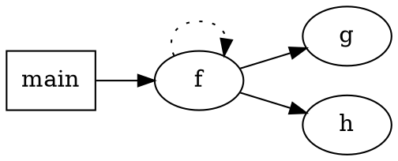

# 环境准备
## 命令行环境
1. 下载`antlr-4.8-complete.jar`到`E:\java3rd_lib`
2. 创建环境变量`CLASSPATH=E:\java3rd_lib\antlr-4.8-complete.jar`
3. (Recommend) 新建目录`E:\custom_cmds`，将路径加入环境变量`Path`
4. (Recommend) 在`custom_cmds`中新建如下文件
    ```shell
    antlr4.bat
    java org.antlr.v4.Tool %*

    antlr4py.bat
    java org.antlr.v4.Tool -Dlanguage=Python3 %*

    grun.bat
    java org.antlr.v4.gui.TestRig %*
    ```
5. (Optional) 使用[pygrun](https://github.com/jszheng/py3antlr4book/blob/master/bin/pygrun)代替`grun`驱动Lexer和Parser。不过有VS Code的插件后这个基本上不需要了

## VS Code

1. 安装[ANTLR4](https://marketplace.visualstudio.com/items?itemName=mike-lischke.vscode-ANTLR4)插件

2. 在`.g4`文件中，**右键菜单**可以选择`railroad diagram`，`ATN graph` 和 `call graph` 三种可视化

3. 创建`.vscode/launch.json`如下，可以开启对应的调试，需要修改的，最多就`grammar`，`input`，`startRule`三个
    ```json
    {
      "version": "2.0.0",
      "configurations": [
        {
          "name": "Debug ANTLR4 grammar",
          "type": "antlr-debug",
          "request": "launch",
          "input": "input.txt",
          "grammar": "Hello.g4",
          // "actionFile": "grammars/exampleActions.js",
          // "startRule": "rt",
          "printParseTree": true,
          "visualParseTree": true
        }
      ]
    }
    ```


# 概况
```g4
stat: assign
    | ifstat
    | whilestat
    ;

assign: ID '=' expr ';' ;

expr: [0-9]+;

ID: [a-z]+;

...
```
小写为parse rule；大写为token rule


Lexer根据规则分token，输出的结果如下，token并不是复制的字符串，尽可能使用已分配的内存
```shell
[@0,0:0='{',<1>,1:0]
[@1,1:2='99',<4>,1:1] # 1号token，char索引1:2，文本99，类型4，第1行，第1号char
[@2,3:3=',',<2>,1:3]
[@3,5:5='3',<4>,1:5]
[@4,6:6=',',<2>,1:6]
[@5,8:10='451',<4>,1:8]
[@6,11:11='}',<3>,1:11]
[@7,13:12='<EOF>',<-1>,2:0]
```

Parser根据TokenStream建立语法树。语法树中的RuleNode有基本的`getChild()`和`getParent()`功能，实际的树节点是基于语法规则拓展的RuleNode的子类，名如`XxxContex`，包含该语法规则的子规则(函数)。**非叶子节点都是一项语法规则，叶子节点就是单纯的一个Token**。

从解析语法文件，分析输入合法性，到语法树建立完成，都是ANTLR4的工作。

之后利用语法树实现具体的行为或功能，就是其他语言的定制化工作。

首先要解决的就是遍历语法树。ANTLR4的运行时，提供了`listener`和`visitor`两套接口。


`ParseTreeWalker`接受一个`listener`和`tree`，`walker`DFS整个树，主动调用`enterXxx`和`exitXxx`接口。`listener`的自定义代码没有树遍历的逻辑，这部分的逻辑是由`walker`控制的。

相反，`visitor`的每个自定义`VisitXxx`方法内，可以主动控制接下来要访问的节点(调用`XxxContext`的实例方法获取)。基础的`ParseTreeVisitor`提供两个通用方法，`visit(NodeContex)`和`visitChildren(NodeContex)`，一个单点访问，一个遍历访问，如果每次都调用`visitChildren`就等同于完整的DFS

```python
def visit(self, tree):
    return tree.accept(self)

def visitChildren(self, node):
    result = self.defaultResult()
    n = node.getChildCount()
    for i in range(n):
        if not self.shouldVisitNextChild(node, result):
            return result

        c = node.getChild(i)
        childResult = c.accept(self)
        result = self.aggregateResult(result, childResult)
    return result
```

> - visitor可以虽然可以控制，但前提是知道树的结构
> - shouldVisitNextChild默认为True
> - aggregateResult，默认返回childResult


# The Book
## Tour

### import
拆分
```g4
// CommonLexerRules.g4
lexer grammar CommonLexerRules; // note "lexer grammar"
ID : [a-zA-Z]+;
INT : [0-9]+ ;
NEWLINE :'\r'? '\n';
WS : [ \t]+ -> skip ; // toss out whitespace
```

使用
```g4
grammar LibExpr;
import CommonLexerRules; // includes all rules from CommonLexerRules.g4
...
```

### error handle

### 解析器内的action

### 重写流

很像Rust中的过程宏。高效地改造源代码。


##  语法设计

### 自定向下的规则制定

以java / csv为例，伪代码描述

### 使用现成的语法手册应该注意什么

有些细枝末节的规则，可以用运行时检查，不必写进规则文件

### 语言模式

- Sequence 元素序列

- Choice 枚举
- Token dependence 符号依赖，比如左右闭合括号
- Nested phrase 自我嵌套

### 优先级 左递归 结合

优先级问题


根据操作符的优先级，中间的语法树才是正确的。ANTLR4根据枚举顺序确定优先级。下列的语法描述就是正确的

```
expr | expr '*' expr // match subexpressions joined with '*' operator 
     | expr '+' expr // match subexpressions joined with '+' operator
     | INT
	 ;
```


关联问题

有的操作符是自右向左结合的，比如`^`，要写成`expr : expr '^'<assoc=right> expr`


左递归

在规则的某个枚举中，直接或间接地在最左侧递归调用了该规则。

上面的`expr`就是直接左递归，可以被ANTLR4处理，如何消除直接左递归在第14章

如下的间接左递归则不可以:

```
expr : expo
     | ...
     ;
expo: expr '^'<assoc=right> expr;
```


❓左递归有什么问题

递归下降方法中，每个规则是一个函数，开始一个规则匹配模式后，一般来讲，看到一个字符，就能正确地展开，调用子规则函数。但是左递归，会导致看不到终结字符而无限递归，如下面的函数

```
expr: expr '+' term;

function expr()
{  
    expr();
    match('+');
    term();
}
```


### 常见模式

Identifiers

```
ID : ID_LETTER (ID_LETTER | DIGIT)* ; // From C language
fragment ID_LETTER : 'a'..'z'|'A'..'Z'|'_' ;
fragment DIGIT : '0'..'9' ;
```

最广泛的Token匹配放到最后放置


NUM

fragment：只是其他词法规则的一部分，不能被一个解析规则所引用。

```
INT: DIGIT+;
FLOAT: DIGIT+ '.' DIGIT* // match 1. 39. 3.14159 etc... 
	 | '.' DIGIT+        // match .1 .14159 ;

fragment
DIGIT : [0-9] ; // match single digit
```


String 

 *？非贪婪匹配
允许转移2-char格式的转移字符

```
STRING: '"' (ESC|.)*? '"' ;
fragment ESC : '\"' | '\\\\' ; // 2-char sequences \" and \\
// 更完整写为 fragment ESC: '\\'[ntbr"\\]; // 2-char \[\"rntb]
```


注释和空格

这个空格规则思路真好

```
LINE_COMMENT : '//' .*? '\r'? '\n' -> skip ; // Match "//" stuff '\n' 
COMMENT : '/*' .*? '*/' -> skip ; // Match "/*" stuff "*/"

WS : [ \t\r\n]+ -> skip ; // match 1-or-more whitespace but discard
```


### 移动词法和解析的界限

- 词法解析应去除解析不关心的字符
- 词法按照解析需要的抽象等级去分析Token
  - 比如JSON解析不区分整形和浮点数，归为NUMBER类；
  - 解析单独处理IP字符串，词法应该识别出IP送给解析层；
  - 要计算IP的hash值，解析层实际需要的是4个数字，可以写一个ip的解析规则，由4个INT的token组成


## 语法设计实践

### CSV

```
field: STRING
     | TEXT
     |
     ;
TEXT: ~[,\n\r"]+;   // 不包含引号
STRING: '"' ('""' | ~'"')* '"';  // 包含引号的单独处理，中间要么没有引号，要么同时出现两个，匹配"$2,000"
```


### JSON

这样看，JSON的语法确实相当简单了

```
object
    : '{' pair (',' pair)* '}'
    | '{' '}'
    ;

array
    : '[' value (',' value)* ']'
    | '[' ']'
    ;
pair: STRING ':' value;

value
    : STRING
    | NUMBER
    | array
    | object
    | BOOLEAN
    | NULL
    ;
```


相对更脏的工作是词法部分。

字符串的词法规则:

```
char
any-Unicode-character-except-"-or-\-or-control-character
\"
\\
\/
\b
\f
\n
\r
\t
\u four-hex-digits
```

把英文翻译为ANTLR4的文法：

```
STRING: '"' (ESC|~[\"])*? '"'; // ~[\"]排除引号和斜杠
fragment ESC: '\\' (["\\/bfnrt]|UNICODE); // 单独列出转义项
fragment UNICODE: 'u' HEX HEX HEX HEX;
fragment HEX: [0-9a-fA-F];
```


数字的词法规则：`A number is very much like a C or Java number, except that the octal and hexadecimal formats are not used.`

无前导的0、指数型等规则 (Python Rust还支持数字中插入'_'分割)。

- 用INT捕获无前导0的合法整型 ⭐最基础
- 用EXP捕获指数后面部分

然后再组合成完整的数字或小数

```
NUMBER:
	| '-'? INT? '.' [0-9]+ EXP? // .3  1.25E7 -4.5 浮点数
	| '-'? INT EXP // 指数型
	| '-'? INT // 整型
	;
fragment INT: '0' | [1-9] [0-9]*; // 无前导0
fragment EXP: [Ee] [+\-]? INT;  // 指数部分
```


### DOT

特点: 

- 声明式语言
- 有语法格式说明手册
- 更丰富的语法规则

[DOT官方语法说明](https://www.graphviz.org/doc/info/lang.html)

样例




照着官方给出的规则翻译就可以，大部分还是比较直接的

```g4
grammar DOT;

graph: STRICT? (GRAPH | DIGRAPH) id? '{' stmt_list '}';
stmt_list: (stmt ';'?)*;

stmt: node_stmt | edge_stmt | attr_stmt | id '=' id | subgraph;

attr_stmt: (GRAPH | NODE | EDGE) attr_list;

// 可以匹配 [shape=box x=y] [color=blue]
attr_list: ('[' (a_list)? ']')+;

// 和书中的不同，按照最新的规范写的，必须有等号
a_list: (id '=' id (';' | ',')?)+;

edge_stmt: (node_id | subgraph) edgeRHS attr_list?;
edgeRHS: (edgeop (node_id | subgraph))+;

edgeop: '->' | '--';
node_stmt: node_id attr_list?;

node_id: id port?;
port: ':' id (':' id)?;

subgraph: (SUBGRAPH id?)? '{' stmt_list '}';

id: ID | NUM | STRING | HTML;

// 终点关键字大小写无关，因为也可以被捕获为ID，所以要放在ID之前
STRICT: [Ss][Tt][Rr][Ii][Cc][Tt];
GRAPH: [Gg][Rr][Aa][Pp][Hh];
DIGRAPH: [Dd][Ii][Gg][Rr][Aa][Pp][Hh];
NODE: [Nn][Oo][Dd][Ee];
EDGE: [Ee][Dd][Gg][Ee];
SUBGRAPH: [Ss][Uu][Bb][Gg][Rr][Aa][Pp][Hh];

/* identifier 字符+数字，不以数字开头 */
ID: LETTER (LETTER | DIGIT)*;

NUM: '-'? (.DIGIT+ | DIGIT+ ('.' DIGIT+)?);
fragment DIGIT: [0-9];
fragment LETTER: [a-zA-Z\u0080-\u00FF_];

/* 双引号的string，可能包含转义的引号\" " */
STRING: '"' ('\\"' | .)*? '"';

// 非递归地确定识别开始和结束的尖括号
HTML: '<' (TAG | ~[<>])* '>';
fragment TAG: '<' .*? '>';

/* 注释和预处理 */
COMMENT: '/*' .*? '*/' -> skip;
LINE_COMMENT: '//' .*? '\r'? '\n' -> skip;
PREPROC: '#' .*? '\n' -> skip;

WS: [ \n\r\t]+ -> skip;
```


### Cymbol

特点：

- 命令式编程语言，类似没有`structs`的C语言，有基本的使用经验
- 进一步熟悉左递归的使用
- 没有语法说明手册，从例子和语言使用经验中推断规则结构

```cymbol
// Cymbol test
int g = 9;        // a global variable
int fact(int x) { // factorial function
    if x==0 then return 1;
    return x * fact(x-1);
}
```


命令式的重要的组成部分，声明Declaration，语句Statement，表达式Expression。

文件由多个全局声明组成

声明 变量声明和函数声明。由声明格式 + 初始化块组成。变量的初始化块是表达式，函数的初始化是语句块

语句块是由大括号`{}`包裹的任意多个语句，**一个语句块也会被认为是一个语句**。顺便一说，正是因为这个，if else 如果只有一个执行语句的时候可以不加`{}`，多个时要加`{}`, 但逻辑上他们都是一个语句。

通常的语句是: 变量声明(也就是局部变量)，判断，循环，赋值，返回语句，以及，函数调用

表达式是经过计算和查找，最后会返回一个值的一段字符，而语句是没有返回值的执行。根据语句行为定义，语句执行可能需要依赖表达式的值，比如`if`的分支判断

因此表达式可以向语句转化，两种方式:
1. 通过语句关键字骨架使用表达式。比如`if then else`的条件控制语句，比如`return ;`的返回语句，`= ;`的赋值语句。
  2. 添加一个分号，比如函数调用。`f(x, y)`是一个表达式，而`f(x, y);`是一个语句。

鉴于表达式的重要地位，表达式的解析就很关键，比如要正确考虑操作符的优先级顺序。函数调用和数组索引 > 一元操作符 > 二元乘除 > 二元加减 > 二元比较 > ...

```g4
grammar Cymbol;

file: (varDecl | functionDecl)+ ;

varDecl: type ID ('=' expr)? ';' ;

type: 'int' | 'float' | 'void';

functionDecl: type ID '(' formalParameters ')' block;

formalParameters: type ID (',' type ID)*;

block: '{' stat* '}';

stat: block
    | varDecl
    | ifstat            // 结构化的语句优先级更高
    | retstat
    | assginstat        // 赋值 a = 2;
    | expr ';'          // 函数调用 f(a+1);
    ;

ifstat: 'if' expr 'then' stat ('else' stat)?;

retstat: 'return' expr? ';' ;

assginstat: expr '=' expr ';' ;

expr: ID '(' exprList? ')' // 函数调用
    | ID '[' expr ']'      // 数组索引, 优先级高于一元'-'，-a[0]
    | '-' ID               // 一元操作符
    | '!' ID
    | expr '*' expr        // 四则运算
    | expr ('+'|'-') expr
    | expr '==' expr  // 最低优先级
    | ID
    | INT
    | '(' expr ')'   // 括号
    ;

exprList: expr (',' expr)* ;


ID: LETTER(LETTER|DIGIT)*;
INT: '0' | [1-9] (DIGIT)*;

fragment LETTER: [a-zA-Z_];
fragment DIGIT: [0-9];


COMMENTS: '//' .*? '\r'?'\n' -> skip;

WS: [ \t\r\n]+ -> skip;
```

### R

特点：

- 函数式编程语言
- 中等体量，但是语句复杂
- 普及度不高，缺乏经验。需要参考手册、例子、其他文法规则(yacc)

> 给不熟悉、缺乏使用经验的语言些Parser，收集材料：准备测试集，查看语言相关的intro和definition； 2. 由上向下、由大到小、由粗到精的探索。


```r
➾ x <- seq(1,10,.5)    # x = 1, 1.5, 2, 2.5, 3, 3.5, ..., 10   
➾ y <- 1:5             # y = 1, 2, 3, 4, 5
➾ z <- c(9,6,2,10,-4)  # z = 9, 6, 2, 10, -4
➾ y + z                # add two vectors
❮ [1] 10 8 5 14 1       # result is 1-dimensional vector
➾ z[z<5]               # all elements in z < 5
❮ [1] 2 -4 
➾ mean(z)              # compute the mean of vector z
❮ [1] 4.6
➾ zero <- function() { return(0) }
➾ zero()
❮ [1] 0
```

语法上，本质大家都是表达式，比如赋值语句`a <- b <- 1:5`, a和b都会指向相同的值
判断语句`if (expr) expr (else expr)?` 也表示分支上的返回值

所以一个R程序，就是由一条条表达式构成的。主要由三种表达式：
1. 语句statement 表达式
2. 操作符operator 表达式
3. 函数相关function-related 表达式

和Cymbol中认为逻辑由语句组成的不同，R直接认为逻辑就由表达式组成的，虽然都是用`{}`组织为逻辑块

剩下的太细节了，就先跳过，有需要再看。


## 应用设计模式

这部分的内容一部分都放入[概况](#概况)一节，Listener和Visitor，这里主要还是补充一些觉得有用的细节

### 增加标签
```
grammar LExpr;

s : e ;

e : e MULT e   # Mult
  | e ADD e    # Add
  | INT        # Int
  ;

MULT: '*' ;
ADD : '+' ;
INT : [0-9]+ ;
WS : [ \t\n]+ -> skip ;
```

会导致Listener，由原来的`enterE/exitE`增加到
```java
public interface LExprListener extends ParseTreeListener { 
  void enterMult(LExprParser.MultContext ctx)
  void exitMult(LExprParser.MultContext ctx)
  void enterAdd(LExprParser.AddContext ctx)
  void exitAdd(LExprParser.AddContext ctx)
  void enterInt(LExprParser.IntContext ctx)
  void exitInt(LExprParser.IntContext ctx)
}
```


### 事件间传递信息

利用语法树执行计算时，需要节点的计算结果的相互配合。

visitor接口可以存在返回值，所以父节点可以利用子节点计算完成后的结果，类比树的递归

```python
class CalcVisitor(LExprVisitor):
    def visitAdd(self, ctx: LExprParser.AddContext):
        return self.visit(ctx.e(0)) + self.visit(ctx.e(1))

    def visitMult(self, ctx: LExprParser.MultContext):
        return self.visit(ctx.e(0)) * self.visit(ctx.e(1))

    def visitInt(seladdf, ctx: LExprParser.IntContext):
        return int(ctx.INT().getText())
```

listener接口没有返回值，中间结果要靠全局字段存，比如计算用栈

```python
class CalcListener(LExprListener):
    def __init__(self):
        self.stack = []

    def result(self):
        assert len(self.stack) == 1
        return self.stack[0]

    def exitAdd(self, ctx: LExprParser.AddContext):
        self.stack.append(self.stack.pop() + self.stack.pop())

    def exitMult(self, ctx: LExprParser.MultContext):
        self.stack.append(self.stack.pop() * self.stack.pop())

    def exitInt(self, ctx: LExprParser.IntContext):
        self.stack.append(int(ctx.INT().getText()))
```

> 相比之下visitor就更灵活，因为它本身也可以增加全局字段来辅助

第三种，标记，在语法树上预留位置，储存中间结果。但是如果让ANTLR4真的在语法树上增加字段，类型是个大问题，和上层运行时绑定了，不同目标语言要求的类型可能还不一样。所以这个模式也交给语言层面，自己建立一个`HashMap<节点:中间结果>`就完事儿了。这种视角可以在visitor和listener基础上使用。

大概这样 
```python
class CalcWithProps(LExprListener):
    def __init__(self):
        self.props = {}

    def result(self, ctx):
        return self.props[ctx]

    def exitS(self, ctx):
        self.props[ctx] = self.props[ctx.e()]

    def exitAdd(self, ctx: LExprParser.AddContext):
        self.props[ctx] = self.props[ctx.e(0)] + self.props[ctx.e(1)]

    def exitMult(self, ctx: LExprParser.MultContext):
        self.props[ctx] = self.props[ctx.e(0)] + self.props[ctx.e(1)]

    def exitInt(self, ctx: LExprParser.IntContext):
        self.props[ctx] = int(ctx.INT().getText())
```

当然Python可以动态修改对象的字段，可以不用额外的字典  

感觉就是树/DAG的遍历，这三个模式参考一下就行了，现在感觉没有很大的分类指导价值，因地制宜想个算法应该最靠谱。


## 应用实践

### CSV 表格

header实际上也的实质也是row，但是父规则就是hdr，而正常的row，父规则是csvfile

所以利用这个特点区分hdr，避免为标题栏建立映射

`antlr4-python3-runtime`没有`getParent()`方法，内容存在`RuleContex.parentCtx`字段

```python
def exitRow(self, ctx: CSVParser.RowContext):
    if ctx.parentCtx.getRuleIndex() == CSVParser.RULE_hdr:
        return
    self.table.append(dict(zip(self.hdrs, self.curr_row_fields)))
```


### Json2Xml

发现之前写的JSON.g4有个警告
```
warning(146): ..../JSON.g4:33:0: non-fragment lexer rule NUMBER can match the empty string
```

就是说Token NUMBER的规则可以匹配空字符串，因为`:`后面紧接着`|`
```
NUMBER:
      | '-'? INT? '.' [0-9]+ EXP? // .3  1.25E7 -4.5 浮点数
      | '-'? INT EXP // 指数型
      | '-'? INT ; // 整型
```


在[事件间传递信息](#事件间传递信息)一节，提到的中间结果，在这里是以该节点为根节点时所形成的Xml文本。
最开始我的想法，在用Templite的逻辑，一次遍历树，在每个节点上直接写入到全局buf中。用栈来维护一些模式信息。
